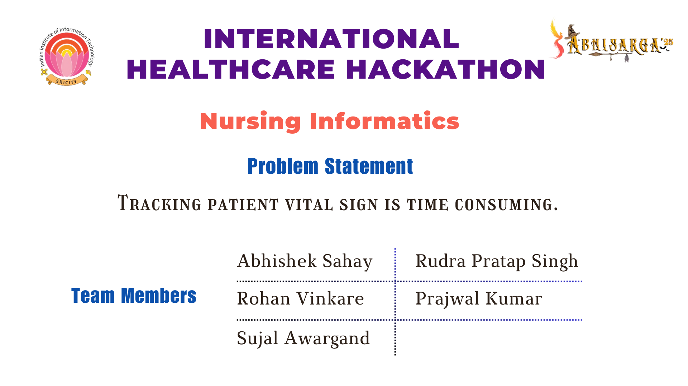
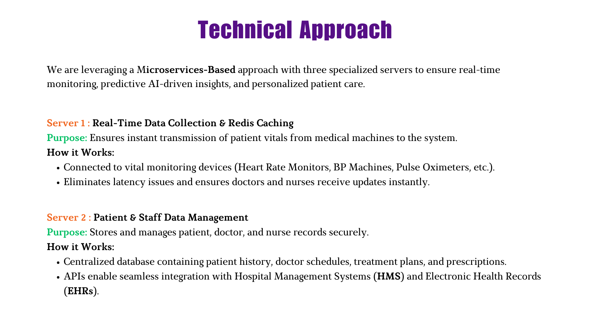
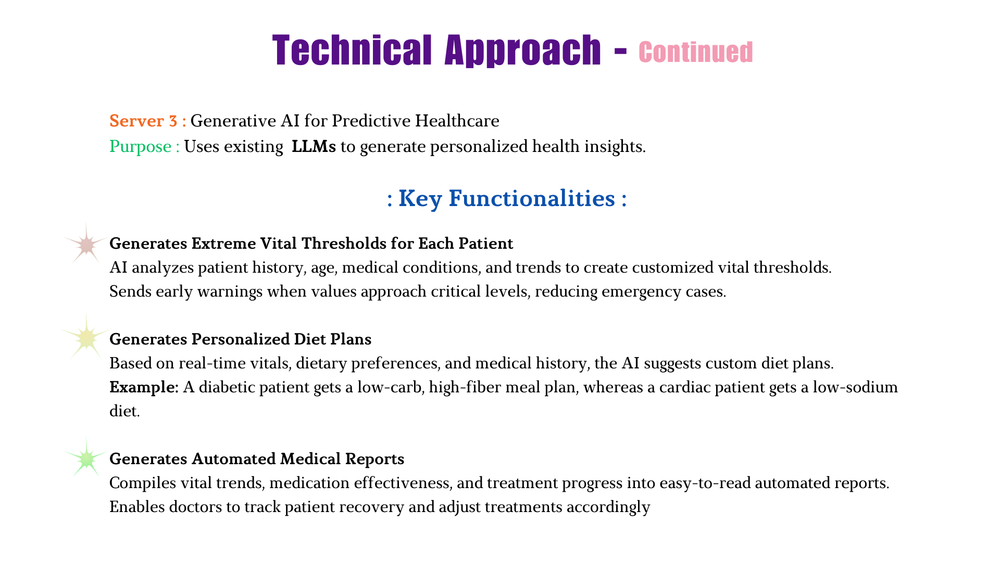
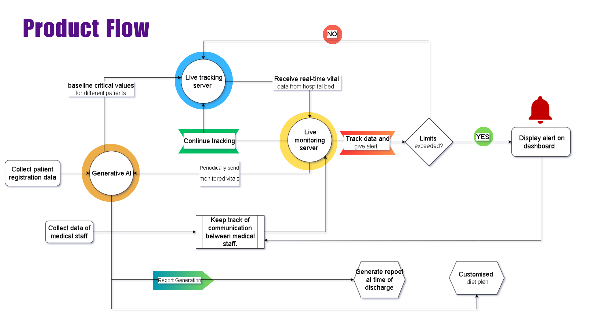
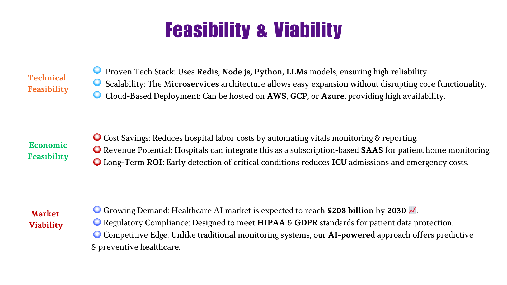
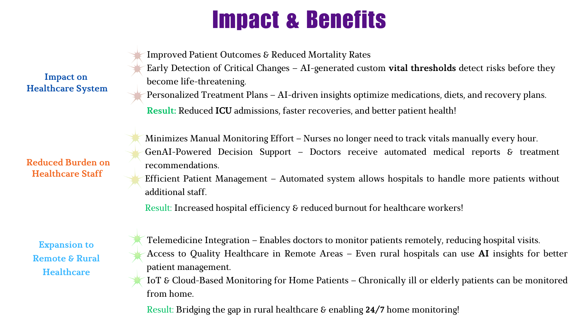
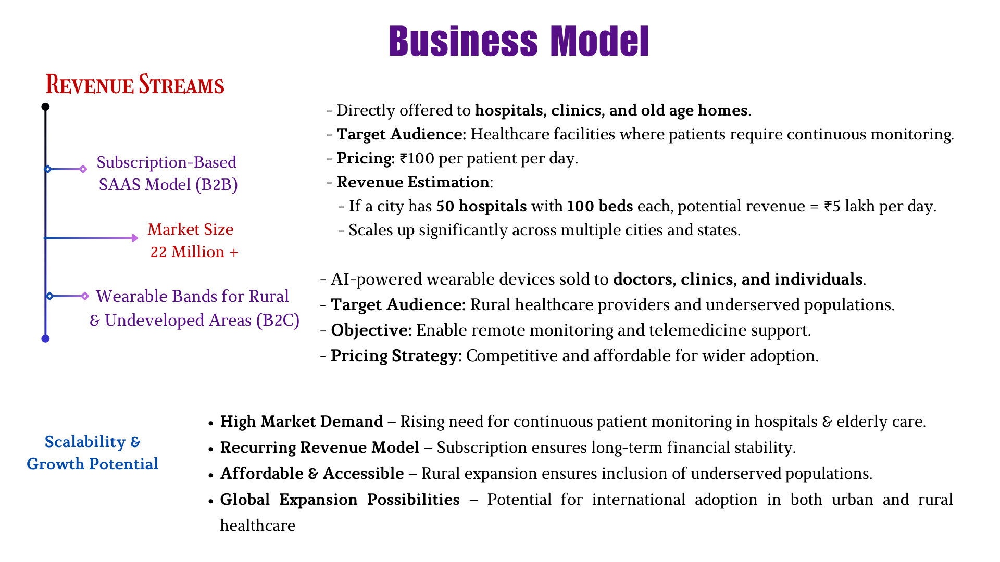
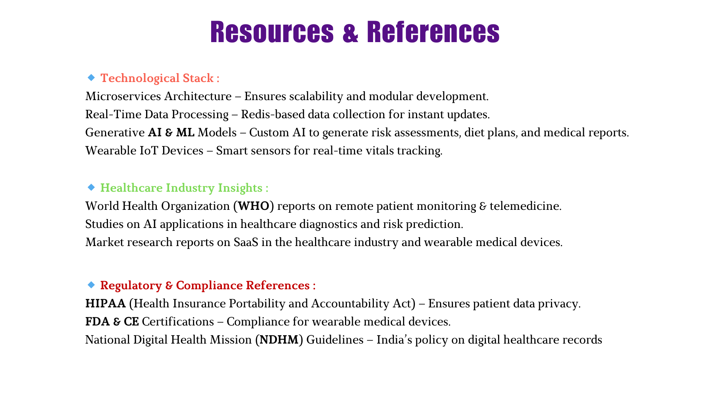

# Swasthik

## AI-Powered Personalized Vital Monitoring System

## Overview

Swasthik is an innovative AI-powered vital monitoring system designed to transform patient care through personalized monitoring and analysis. Unlike traditional vital sign monitoring that applies universal thresholds, Swasthik uses generative AI to establish individualized baseline ranges for each patient, enabling earlier detection of concerning changes and improving patient outcomes.

## Key Features

### Personalized Vital Monitoring

- _Custom Baseline Detection_: Analyzes patient demographics, medical history, and environmental factors to establish personalized vital sign ranges
- _Real-time Monitoring_: Continuously tracks patient vitals and alerts healthcare providers when readings deviate from individual baselines
- _Trend Analysis_: Identifies subtle patterns in vital signs that may indicate developing issues before they become critical

### AI-Generated Reports & Guidance

- _Automated Patient Reports_: Generates comprehensive reports including vital trends, medication adherence tracking, and warning signs
- _Personalized Diet Charts_: Creates customized nutritional guidance for discharged patients based on doctor recommendations
- _Medication Management_: Tracks and provides reminders for medication schedules

### User-Friendly Interface

- _Intuitive Dashboard_: Color-coded indicators showing personalized ranges for easy interpretation
- _Mobile Compatibility_: Accessible from any device with offline capabilities for areas with intermittent connectivity
- _Low Technical Requirements_: Runs efficiently on low-power devices with minimal bandwidth

## Technical Specifications

### Tech Stack (MERN)

- _Frontend_: React.js web application
- _Backend_: Node.js with Express
- _Database_: MongoDB for patient data storage
- _Real-time Communication_: Socket.IO for instant vital updates and alerts
- _Caching_: Redis for performance optimization and session management
- _AI Model_: GEN AI(based LLM Model)

### System Requirements

- Node.js (v14.x or higher)
- MongoDB (v4.x or higher)
- Redis (v6.x or higher)
- NPM (v7.x or higher)
- Modern web browser with WebSocket support

### Integration Capabilities

- Works with existing vital monitoring equipment
- HL7/FHIR compatible for integration with Electronic Health Records (EHR)
- Secure data transfer protocols compliant with healthcare standards

## Implementation Guide

### Setup

1. Clone the repository
2. Install dependencies using npm install for both frontend and backend
3. Configure environment variables in .env file:

   MONGODB_URI=your_mongodb_connection_string
   REDIS_URL=your_redis_connection_string
   PORT=3000
   NODE_ENV=development

4. Start MongoDB: mongod
5. Start the backend server: npm start
6. For concurrent development: npm run dev

### Configuration Options

- _Facility Settings_: Customize alert thresholds and notification preferences
- _User Roles_: Configure access permissions for different staff roles
- _Report Templates_: Customize report formats and included metrics
- _Socket Events_: Configure real-time event handling and alerts

## Benefits

### For Healthcare Providers

- Reduces vital sign documentation time by 73%
- Increases patient throughput by 30% without sacrificing quality of care
- Enables early intervention for potential complications

### For Patients

- Improves recovery outcomes through personalized monitoring
- Reduces readmission rates with better post-discharge guidance
- Provides peace of mind with continuous monitoring

### For Rural & Underserved Areas

- Works effectively with limited resources and connectivity
- Extends specialized care capabilities to remote locations
- Maximizes efficiency of limited healthcare staff

## Privacy & Security

Swasthik is built with patient privacy as a priority:

- End-to-end encryption for all patient data
- HIPAA/GDPR compliant data handling

## License

This project is licensed under the [MIT License](LICENSE.md).

---

"Prevention is better than cure."

